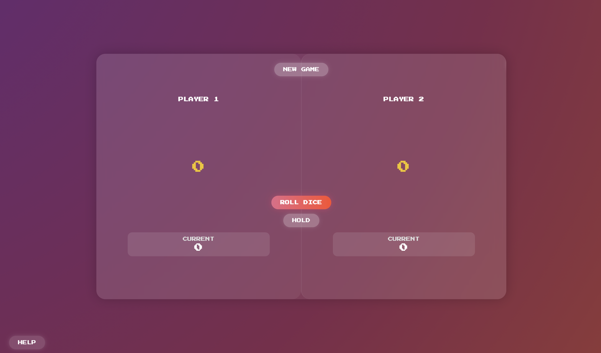

# Hold or Lose – Dice Game

A simple two-player dice game built using HTML, CSS, and JavaScript. The first player to reach 100 points wins. 

This project was created for learning DOM manipulation and JavaScript logic.

---

##  Screenshot

---

##  Game Rules

- Two players take turns.
- On a turn, click **Roll Dice** to roll.
  - If the roll is not 1, it adds to your current round score.
  - If the roll is 1, your round score is lost and the turn switches.
- Click **Hold** to add your current round score to your total.
- First player to reach **100 points** wins.

---

##  How to Play

1. Click **Roll Dice** to start your turn.
2. Click **Hold** to save your score and pass the turn.
3. Avoid rolling a 1 — it resets your current turn score.
4. Click **New Game** to reset at any time.

---

##  Tech Stack

- HTML5
- CSS3
- Vanilla JavaScript

---

##  Live Demo

[View Live on Vercel](https://hold-or-lose-dice.vercel.app)  
